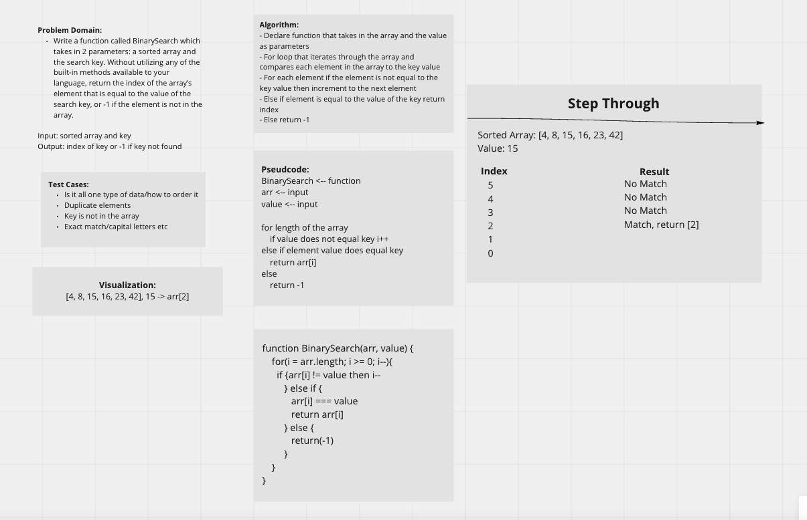

# Insert and shift an array in middle at index

Write a function called BinarySearch which takes in 2 parameters: a sorted array and the search key. Without utilizing any of the built-in methods available to your language, return the index of the array’s element that is equal to the value of the search key, or -1 if the element is not in the array.

## Whiteboard Process

## Collaborators

Mandela Steele-Dadzie
Stephen Martinez

## Approach and Efficiency

- Declare function that takes in the array and the value as parameters
- For loop that iterates through the array and compares each element in the array to the key value
- For each element if the element is not equal to the key value then increment to the next element
- Else if element is equal to the value of the key return index
- Else return -1
