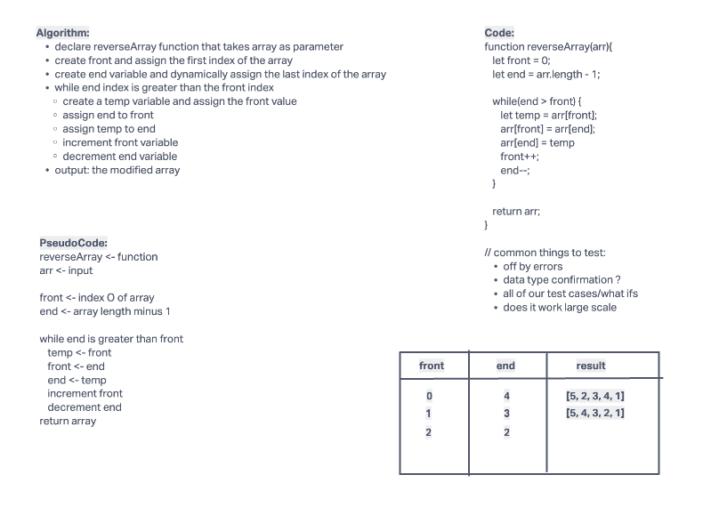

# Reverse an Array

Write a function called reverseArray which takes an array as an argument. Without utilizing any of the built-in methods available to your language, return an array with elements in reversed order.

## Whiteboard Process

## Approach and Efficiency

declare reverseArray function that takes array as parameter
create front and assign the first index of the array
create end variable and dynamically assign the last index of the array
while end index is greater than the front index
create a temp variable and assign the front value
assign end to front
assign temp to end
increment front variable
decrement end variable
output: the modified array
