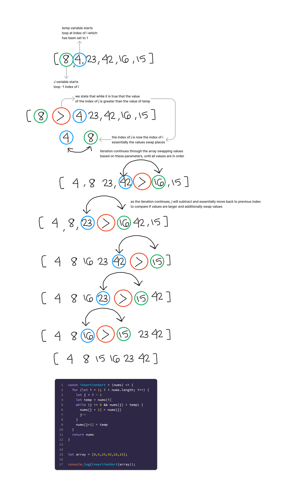

# insertion sort

## Branch: insertion-sort

*Insertion sort iterates, consuming one input element each repetition, and grows a sorted output list. At each iteration, insertion sort removes one element from the input data, finds the location it belongs within the sorted list, and inserts it there. It repeats until no input elements remain.*

*Sorting is typically done in-place, by iterating up the array, growing the sorted list behind it. At each array-position, it checks the value there against the largest value in the sorted list (which happens to be next to it, in the previous array-position checked). If larger, it leaves the element in place and moves to the next. If smaller, it finds the correct position within the sorted list, shifts all the larger values up to make a space, and inserts into that correct position.*

*The best case input is an array that is already sorted. In this case insertion sort has a linear running time (i.e., O(n)). During each iteration, the first remaining element of the input is only compared with the right-most element of the sorted subsection of the array.*

*The simplest worst case input is an array sorted in reverse order. The set of all worst case inputs consists of all arrays where each element is the smallest or second-smallest of the elements before it. In these cases every iteration of the inner loop will scan and shift the entire sorted subsection of the array before inserting the next element. This gives insertion sort a quadratic running time (i.e., O(n2)).*

References:

- [geeksforgeeks](https://www.geeksforgeeks.org/insertion-sort/)
- [w3resource](https://www.w3resource.com/csharp-exercises/searching-and-sorting-algorithm/searching-and-sorting-algorithm-exercise-6.php)
- [wikipedia](https://en.wikipedia.org/wiki/Insertion_sort)
