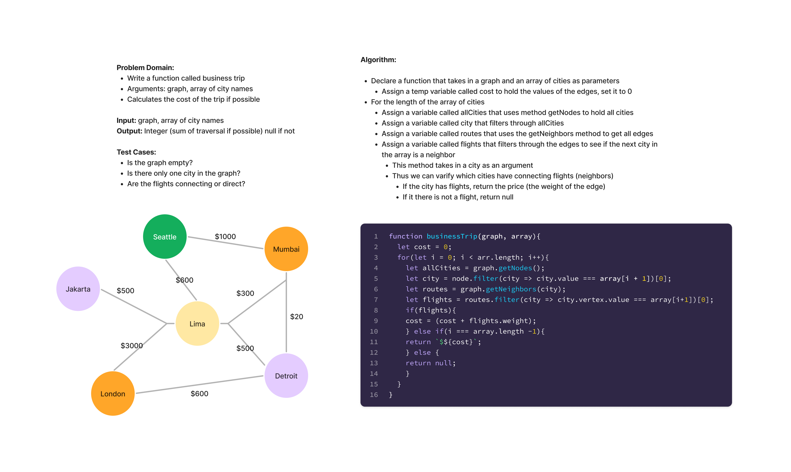

# Business Trip

## Branch: graph-business-trip

## Approach and Efficiency

- Utilized the built in methods for both my graph class as well as built in array methods
- Space: O(N)
- Time: O(N)

References:

- [Dijkstra's algorithm](https://en.wikipedia.org/wiki/Dijkstra%27s_algorithm)
- [Graph algorithms](https://staffwww.fullcoll.edu/aclifton/cs133/lecture-23-weighted-graph-algorithms.html)
- [Luis](https://github.com/RosalesJr/data-structures-and-algorithms)
