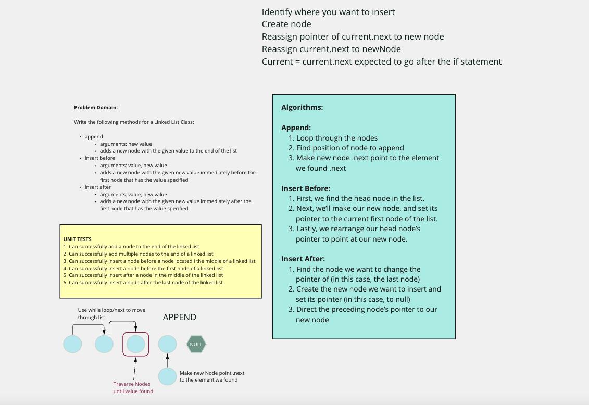
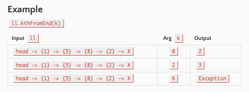
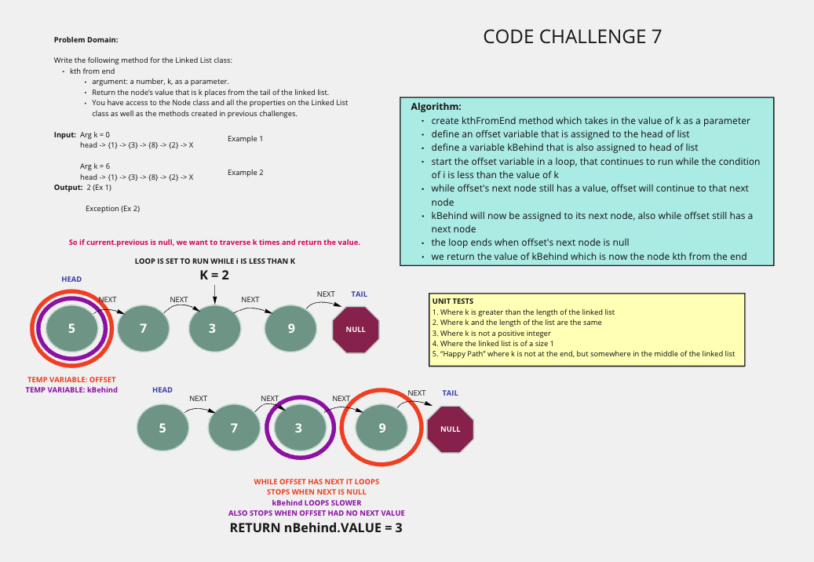
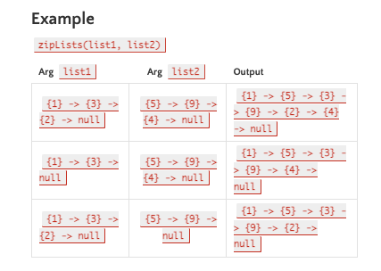
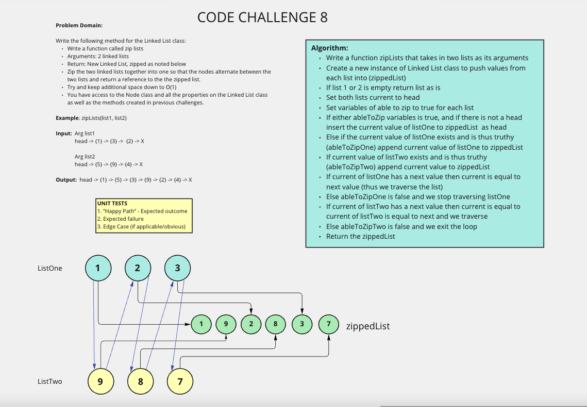

# Linked Lists

## Features

### Node

- Create a Node class that has properties for the value stored in the Node, and a pointer to the next Node.

### Linked List

- Create a Linked List class
- Within your Linked List class, include a head property.
- Upon instantiation, an empty Linked List should be created.
- The class should contain the following methods
- insert
- Arguments: value
- Returns: nothing
- Adds a new node with that value to the head of the list with an O(1) Time performance.
- includes
- Arguments: value
- Returns: Boolean
- Indicates whether that value exists as a Node’s value somewhere within the list.
- to string
- Arguments: none
- Returns: a string representing all the values in the Linked List, formatted as:
  - "{ a } -> { b } -> { c } -> NULL"

### Structure and Testing

1. Can successfully instantiate an empty linked list
2. Can properly insert into the linked list
3. The head property will properly point to the first node in the linked list
4. Can properly insert multiple nodes into the linked list
5. Will return true when finding a value within the linked list that exists
6. Will return false when searching for a value in the linked list that does not exist
7. Can properly return a collection of all the values that exist in the linked list

## Code Challenge 6

## branch: linked-list-insertions

### New Methods

- append
  - arguments: new value
  - adds a new node with the given value to the end of the list
- insert before
  - arguments: value, new value
  - adds a new node with the given new value immediately before the first node that has the value specified
- insert after
  - arguments: value, new value
  - adds a new node with the given new value immediately after the first node that has the value specified

### Unit Tests

1. Can successfully add a node to the end of the linked list
2. Can successfully add multiple nodes to the end of a linked list
3. Can successfully insert a node before a node located i the middle of a linked list
4. Can successfully insert a node before the first node of a linked list
5. Can successfully insert after a node in the middle of the linked list
6. Can successfully insert a node after the last node of the linked list

## Code Challenge 7

## branch: linked-list-kth

### Method kth from end for Linked List class

- argument: a number, k, as a parameter.
- Return the node’s value that is k places from the tail of the linked list.
- Has access to the Node class and all the properties on the Linked List class as well as the methods created in previous challenges.

### unit tests

1. Where k is greater than the length of the linked list
2. Where k and the length of the list are the same
3. Where k is not a positive integer
4. Where the linked list is of a size 1
5. “Happy Path” where k is not at the end, but somewhere in the middle of the linked list

## Code Challenge 8

### Feature Tasks

- Write a function called zip lists
- Arguments: 2 linked lists
- Return: New Linked List, zipped as noted below
- Zip the two linked lists together into one so that the nodes alternate between the two lists and return a reference to the the zipped list.
- Try and keep additional space down to O(1)
- You have access to the Node class and all the properties on the Linked List class as well as the methods created in previous challenges.

## branch: zip-lists

