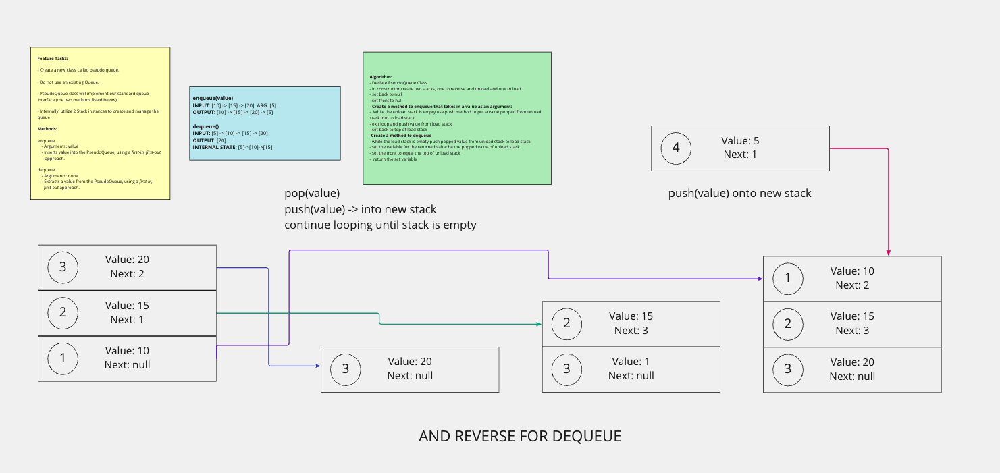

# stacks and queues

;

## Code Challenge 10

### Features

- Using a Linked List as the underlying data storage mechanism, implement both a Stack and a Queue
- Create a Node class that has properties for the value stored in the Node, and a pointer to the next node.

### Stack

- Create a Stack class that has a top property. It creates an empty Stack when instantiated.
This object should be aware of a default empty value assigned to top when the stack is created.

#### The class should contain the following methods:

##### push

- Arguments: value
- adds a new node with that value to the top of the stack with an O(1) Time performance.

##### pop

- Arguments: none
- Returns: the value from node from the top of the stack
- Removes the node from the top of the stack
- Should raise exception when called on empty stack

##### peek

- Arguments: none
- Returns: Value of the node located at the top of the stack
- Should raise exception when called on empty stack
is empty
- Arguments: none
- Returns: Boolean indicating whether or not the stack is empty.

### Queue

- Create a Queue class that has a front property.
- It creates an empty Queue when instantiated.
- This object should be aware of a default empty value assigned to front when the queue is created.

#### The class should contain the following methods

##### enqueue

- Arguments: value
- adds a new node with that value to the back of the queue with an O(1) Time performance.

##### dequeue

- Arguments: none
- Returns: the value from node from the front of the queue
- Removes the node from the front of the queue
- Should raise exception when called on empty queue

##### peek

- Arguments: none
- Returns: Value of the node located at the front of the queue
- Should raise exception when called on empty stack
- is empty
- Arguments: none
- Returns: Boolean indicating whether or not the queue is empty

## Code Challenge 11: Pseudoqueue

### branch: stack-queue-pseudo

#### Create a new class called pseudo queue

- Do not use an existing Queue.
- Instead, this PseudoQueue class will implement our standard queue interface (the two methods listed below),
- Internally, utilize 2 Stack instances to create and manage the queue

#### Methods:

- enqueue:
  - Arguments: value
  - Inserts value into the PseudoQueue, using a first-in, first-out approach.
- dequeue:
  - Arguments: none
  - Extracts a value from the PseudoQueue, using a first-in, first-out approach.

## Code Challenge 12: Animal Shelter

### branch: stack-queue-animal-shelter

- Create a class called AnimalShelter which holds only dogs and cats.
- The shelter operates using a first-in, first-out approach.
- Implement the following methods:
  - enqueue
    - Arguments: animal
    - animal can be either a dog or a cat object.
  - dequeue
    - Arguments: pref
    - pref can be either "dog" or "cat"
  - Return: either a dog or a cat, based on preference.
    - If pref is not "dog" or "cat" then return null.

## Code Challenge 13: Stack Queue Brackets

### branch: stack-queue-brackets

- Write a function called validate brackets
- Arguments: string
- Return: boolean
  - representing whether or not the brackets in the string are balanced

- There are 3 types of brackets:

  - Round Brackets : `()`
  - Square Brackets : `[]`
  - Curly Brackets : `{}`

